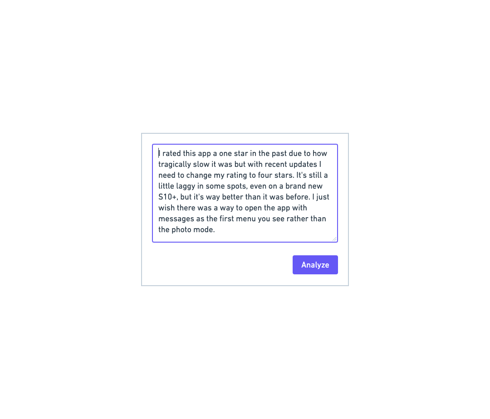
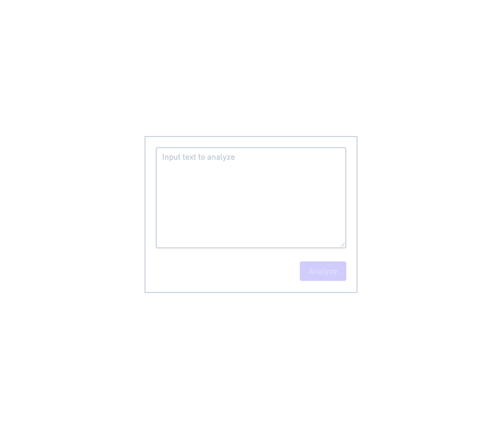
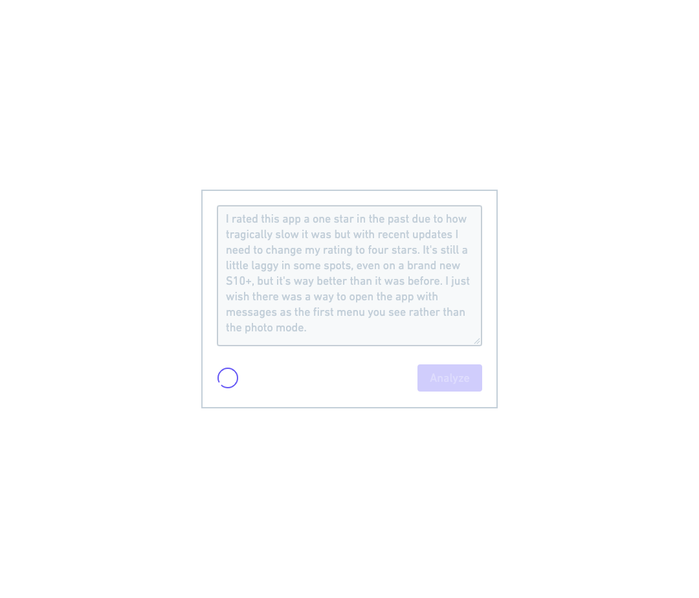
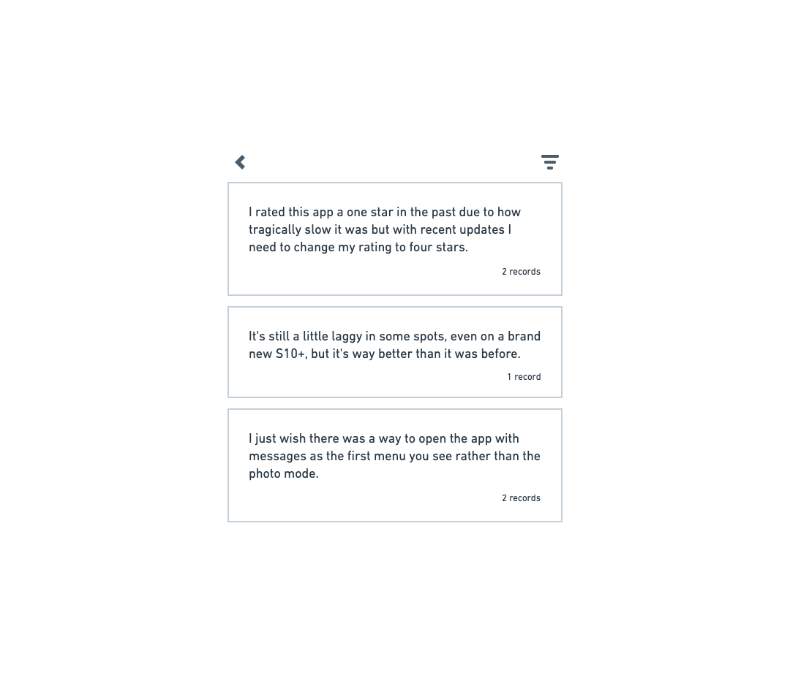
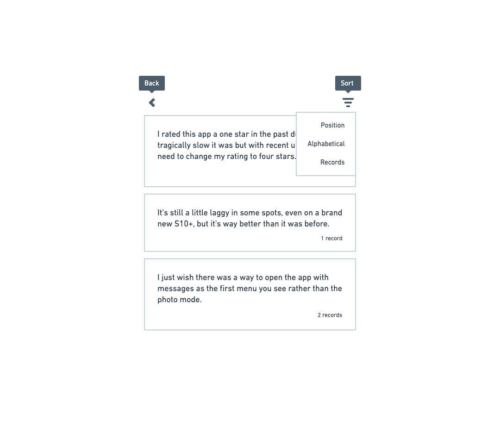
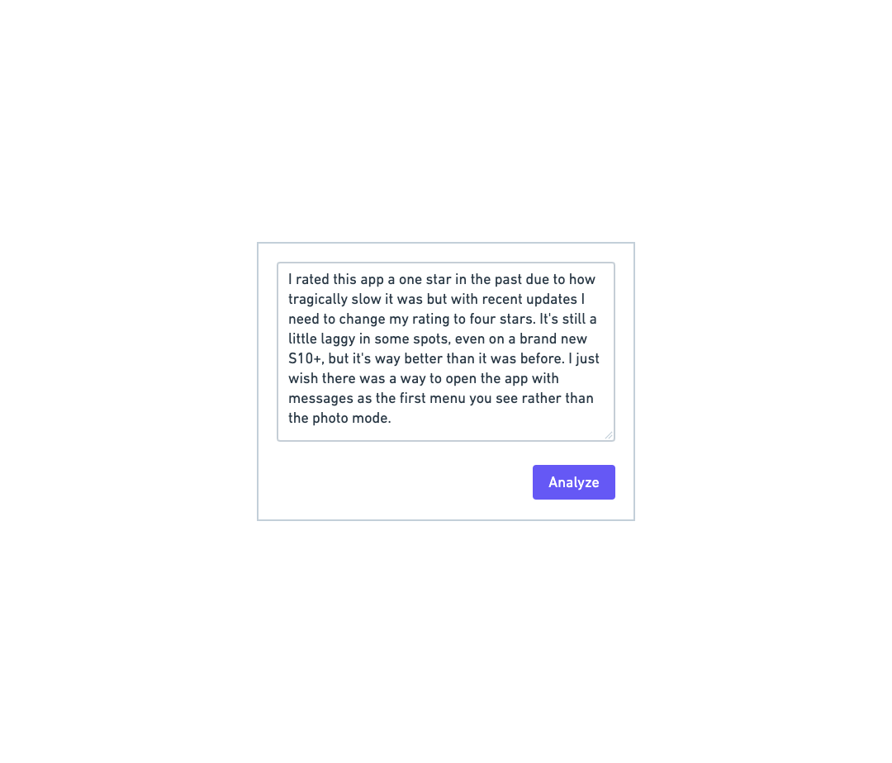

# React Challenge

The goal of this challenge is to implement a feature in React using an existing codebase and your interpretation of wireframes and requirements. There is no time limit but I will be curious to know how long it took to complete.

Editor settings for Visual Studio Code have been included for code formatting and linting.

# Setup and prerequisites

### Technology in use

- [Typescript](https://www.typescriptlang.org/docs/)
- [React](https://reactjs.org/)
- [Material UI](https://material-ui.com/getting-started/usage/)
- [JSS](https://material-ui.com/styles/basics/) with Material UI helpers
- [Mobx](https://mobx.js.org/README.html)

### Dependencies

Install the latest stable node [v15](https://nodejs.org/en/).

Install npm dependencies.

```bash
npm install
```

Ensure you're setup by starting the dev server and visiting [localhost:1234](http://localhost:1234/).

```bash
npm start
```

Something not working? Don't hesitate to email [david@caravelapp.com](mailto:david@caravelapp.com) with any questions 👋

# Feature

For this challenge, you'll be creating a small app that accepts a body of text, splits and cleans that text into sentences, and then displays that "analysis" in a new list view.
The list view should be sortable, and should include a "usage" count of how many billable records the given body of text will consume on a hypothetical Caravel plan.

Avoid using local state (where practical) in favor of Mobx stores. The general store structure has been provided, with two stores for you to use: `UIStore` and `TextSegmentStore`.
You might keep properties like the current view (`form` or `list`) in a `currentView` property, or a `loading` state—on the `UIStore`.
On the `TextSegmentStore`, you might keep track of `TextSegment` objects and the sort order of that collection.
Check out the [Mobx documentation](https://mobx.js.org/README.html) for more information.

**You are free to add any third-party dependency that you feel is helpful, just make sure they end up in `package.json`.**

### Component structure

Components are split into various files to help with maintainability. **Container** components always use the `observer` function from `mobx-react` to ensure they render when observables change, and should only render a view. This is the component where you'll be fetching the root store with the `useStore` hook.

**View** components are functional React components without access to Mobx stores (values must be passed through props) and are only concerned with presentation and styles. Styles can be defined in a view component or in a separate `{componentName}-styles.ts` file.

### Interpreting wireframes

We do all of our product designs in lo-fi wireframes, and let Material UI and the Engineer make decisions on how it should end up.
Sizes, spacing, and color are up for interpretation. For instance, we generally use 8px or 16px for padding and margins (check out [theme spacing](https://material-ui.com/customization/spacing/)). For this challenge, there's no real wrong answers for sizing and spacing.

### Submitting your solution

Zip up your source code (excluding `.cache`, `dist`, and `node_modules`) and attach to our email thread or mail to [david@caravelapp.com](mailto:david@caravelapp.com).
Include any additional instructions that may be needed to run your solution.

## Wireframes and requirements

This is the starting point for this challenge and will be included in the source.



### On change

- [ ] Prevent empty strings from being processed



### On submit

- [ ] Display indeterminate [circular progress](https://material-ui.com/api/circular-progress/)
- [ ] Disable text area and submit button



### Mock API call to process text and calculate usage

- [ ] Break text into cleaned sentences (consider newline characters and excessive whitespace)
- [ ] Calculate usage metric per sentence/segment (1 record per every 100 characters)
  - 140 characters == 2 records
  - 80 characters == 1 record
- [ ] Update `store.textSegmentStore.textSegments` array

### Implement list view of processed sentences

- [ ] Create a sortable list with reusable components
  - Use Material UI components where possible
- [ ] Display sentence and record count
- [ ] Add a back button

  - Returns to form with original unprocessed text

  ```tsx
  import ChevronLeftIcon from '@material-ui/icons/ChevronLeft';
  ```

- [ ] Add a sort button with menu

  - Sort by position in message, alphabetical order, and by record count.

  ```tsx
  import SortIcon from '@material-ui/icons/Sort';
  ```



- [ ] Add tooltips to icon buttons



### On back

When pressing back, return to the form with the original message content.


